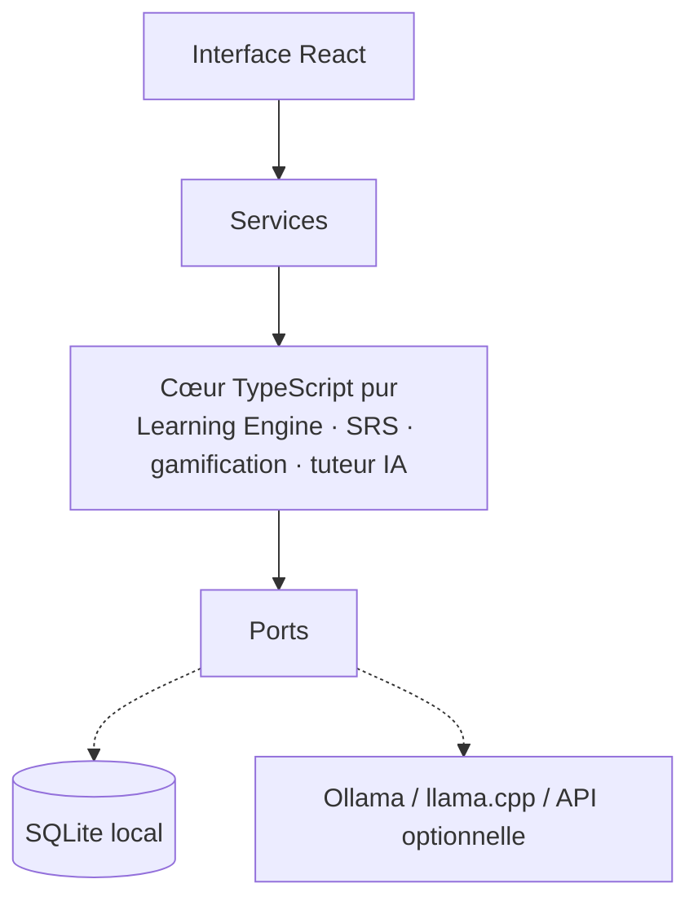

<p align="center"></p>

<h1 align="center">Savio</h1>

<p align="center">Un compagnon d’apprentissage libre, gratuit et local.<br/>Révisions espacées, tuteur IA, progression — et tes données restent sur ton ordinateur.</p>

---

## Présentation

Savio aide à apprendre un peu chaque jour, dans plusieurs domaines, depuis une seule application Windows :

- **Révision espacée moderne** (algorithme FSRS) : chaque notion revient juste avant que tu l’oublies.
- **Tuteur IA** qui connaît ta progression : il explique, questionne, repère tes confusions récurrentes et propose des cartes.
- **IA locale par défaut** avec [Ollama](https://ollama.com) : gratuit, hors ligne, privé. Un serveur distant reste possible, jamais imposé.
- **Progression honnête** : XP, niveaux et série de jours qui récompensent l’apprentissage réel, pas les clics.
- **Libre** : pas d’abonnement, pas de publicité, pas de collecte de données.

Matières de départ : espagnol, anglais, échecs (notions), islam (bases sourcées). Arabe, français, allemand, italien et mathématiques sont disponibles avec le tuteur ; leurs contenus arrivent dans les prochaines versions.

> **Statut : version 0.1 en développement (phase 1 — fondation).** Voir la [roadmap](#roadmap).

## Captures d’écran

_À ajouter avec la première version publiée (`docs/screenshots/`)._

## Architecture



Le cœur (`src/core`) ne dépend ni de React ni de Tauri : il pourra servir pour le web et le mobile. Détails complets : [`docs/ARCHITECTURE.md`](docs/ARCHITECTURE.md).

| Domaine | Technologies |
|---|---|
| Application desktop | Tauri 2 (Rust), WebView2 |
| Interface | React 19, TypeScript strict, Vite |
| Données | SQLite (`tauri-plugin-sql`), migrations versionnées |
| IA | Ollama, serveurs compatibles OpenAI (llama.cpp, LM Studio, vLLM) |
| Qualité | Vitest, ESLint, Prettier, GitHub Actions |

## Installation (utilisateurs)

1. Télécharge `Savio_x.y.z_x64-setup.exe` depuis la page [Releases](../../releases).
2. Lance l’installateur (installation pour ton utilisateur, sans droits administrateur).
3. Windows peut afficher « Windows a protégé votre ordinateur » tant que l’installateur n’est pas signé : clique sur **Informations complémentaires**, puis **Exécuter quand même**.
4. Facultatif, pour le tuteur IA : installe [Ollama](https://ollama.com/download), puis dans un terminal :

   ```powershell
   ollama pull qwen2.5:3b
   ```

   Sur un PC avec 16 Go de RAM ou un GPU, un modèle plus grand donne de meilleures explications (voir [IA locale](docs/ARCHITECTURE.md#20-stratégie-ia-locale--open-source)).

## Développement sous Windows

### Prérequis (une seule fois)

1. **Node.js 22 LTS** (≥ 22.13) : <https://nodejs.org> — ou `winget install OpenJS.NodeJS.LTS`
2. **Rust** : <https://rustup.rs> — ou `winget install Rustlang.Rustup`, puis `rustup default stable`
3. **Microsoft C++ Build Tools** : <https://visualstudio.microsoft.com/visual-cpp-build-tools/> — cocher **« Développement Desktop en C++ »**
4. **WebView2** : déjà présent sur Windows 10 (à jour) et Windows 11.
5. **Git** : `winget install Git.Git`

Vérification :

```powershell
node -v      # v22.13 ou plus
npm -v
rustc -V
cargo -V
```

### Lancer le projet

```powershell
git clone https://github.com/SneyEU/savio.git
cd savio
npm install
```

| Commande | Effet |
|---|---|
| `npm run dev` | Interface seule dans le navigateur (<http://localhost:1420>), données en mémoire. Pas besoin de Rust. |
| `npm run tauri:dev` | Application Windows native avec rechargement à chaud et vraie base SQLite. Le premier lancement compile Rust (quelques minutes). |
| `npm test` | Tests du moteur d’apprentissage et des dépôts SQLite |
| `npm run check` | Lint + types + tests (à lancer avant chaque PR) |

### Générer l’installateur `.exe`

```powershell
npm run tauri:build
```

Résultat :

```text
src-tauri\target\release\bundle\nsis\Savio_0.1.0_x64-setup.exe
```

Double-clique dessus pour l’installer. Les données de l’application sont stockées dans `%APPDATA%\org.savio.app\savio.db`.

### Configuration

Aucune configuration n’est obligatoire. Les options de développement sont décrites dans [`.env.example`](.env.example) (copier en `.env`). Le fournisseur IA se règle dans l’application : **Réglages → Intelligence artificielle**. Aucune clé d’API ne doit jamais être commitée.

## Tests

```powershell
npm test
```

Couvre l’algorithme FSRS, les échelons de maîtrise, l’XP, la série de jours, le planificateur de session, le modèle apprenant (confusions récurrentes, graphe de prérequis), les providers IA (flux Ollama et OpenAI, repli hors ligne) et les dépôts SQLite sur le vrai schéma.

## Intégration continue

- `ci.yml` : lint, types, tests et build à chaque push et pull request ; vérification `cargo fmt` et `clippy` du shell Tauri.
- `build-windows.yml` : construit l’installateur sur `windows-latest` à chaque push sur `main` (artifact **savio-windows-setup**) et crée un brouillon de Release pour chaque tag `v*.*.*`.

## Mises à jour automatiques

Une fois Savio installé, il vérifie au démarrage si une nouvelle version existe sur GitHub. Si oui, un bandeau propose **Mettre à jour** : téléchargement, installation et redémarrage se font tout seuls, sans perdre la progression. Chaque mise à jour est **signée** ; l'application refuse un fichier dont la signature ne correspond pas. La vérification peut être désactivée dans **Réglages → Mises à jour**.

### Publier une nouvelle version (mainteneurs)

1. Une seule fois : ajouter les secrets `TAURI_SIGNING_PRIVATE_KEY` et `TAURI_SIGNING_PRIVATE_KEY_PASSWORD` dans **Settings → Secrets and variables → Actions**.
2. Onglet **Actions → Publier une version → Run workflow**, saisir la version (ex. `0.2.0`) et, si on veut, les nouveautés.
3. Le workflow met à jour le numéro de version, crée le tag, construit l'installateur signé et publie la Release. Les utilisateurs reçoivent la proposition de mise à jour au lancement suivant.

La clé privée de signature ne doit jamais être commitée ni partagée. Si elle est perdue, les versions déjà installées ne pourront plus se mettre à jour automatiquement : il faudra réinstaller manuellement une version signée avec une nouvelle clé.

## Roadmap

| Phase | Contenu |
|---|---|
| **1 — Fondation** (en cours) | Application Windows, onboarding, tableau de bord, révisions FSRS, tuteur IA local, XP et série, SQLite, CI |
| **2 — Langues et voix** | Exercices de langue variés, conversations scénarisées, synthèse et reconnaissance vocales locales, commandes vocales, « Répète après moi » |
| **3 — Échecs, Islam, sources** | Échiquier, puzzles, Stockfish, module Islam avec recherche dans des sources citées (RAG) |
| **4 — Ouverture** | Plugins de contenu, synchronisation optionnelle auto-hébergeable, mises à jour automatiques, macOS, web, mobile |

Suivi détaillé : [`docs/PROGRESS.md`](docs/PROGRESS.md).

## Contribuer

Toutes les contributions sont bienvenues, y compris sans programmer (contenus, traductions, tests utilisateurs). Lis [`CONTRIBUTING.md`](CONTRIBUTING.md) et le [code de conduite](CODE_OF_CONDUCT.md). Failles de sécurité : [`SECURITY.md`](SECURITY.md).

## Licence

- Code : **GNU AGPL-3.0-or-later** — chacun peut utiliser, modifier et redistribuer Savio, à condition de partager ses modifications, y compris quand le logiciel est proposé en ligne.
- Contenus pédagogiques originaux : **CC BY-SA 4.0**.
- Contenus tiers : voir [`docs/CONTENT_LICENSES.md`](docs/CONTENT_LICENSES.md).

Le raisonnement complet est dans [`docs/ARCHITECTURE.md`](docs/ARCHITECTURE.md#19-licence-recommandée).
