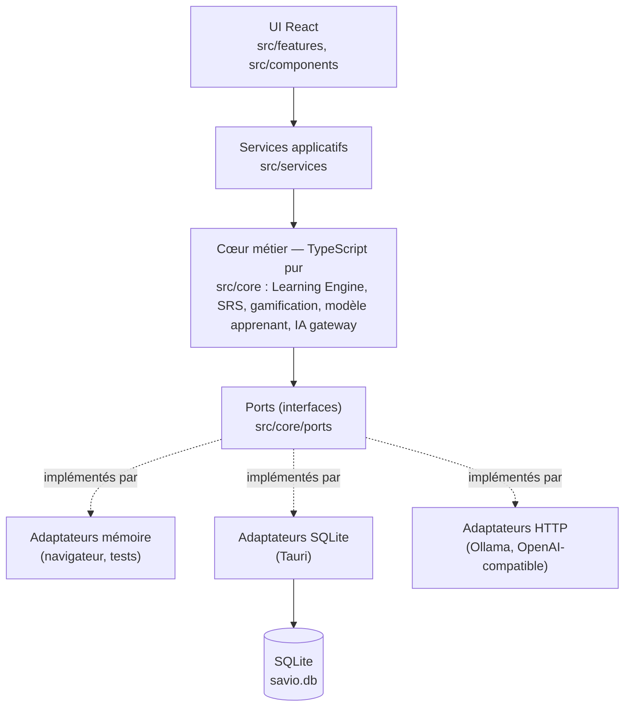
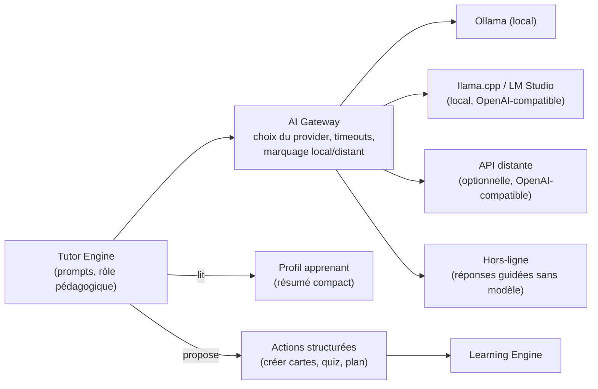
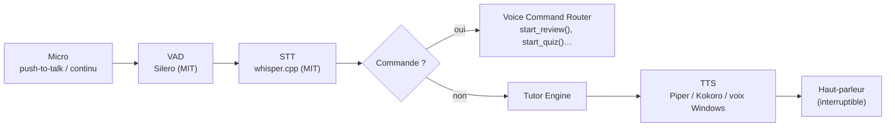
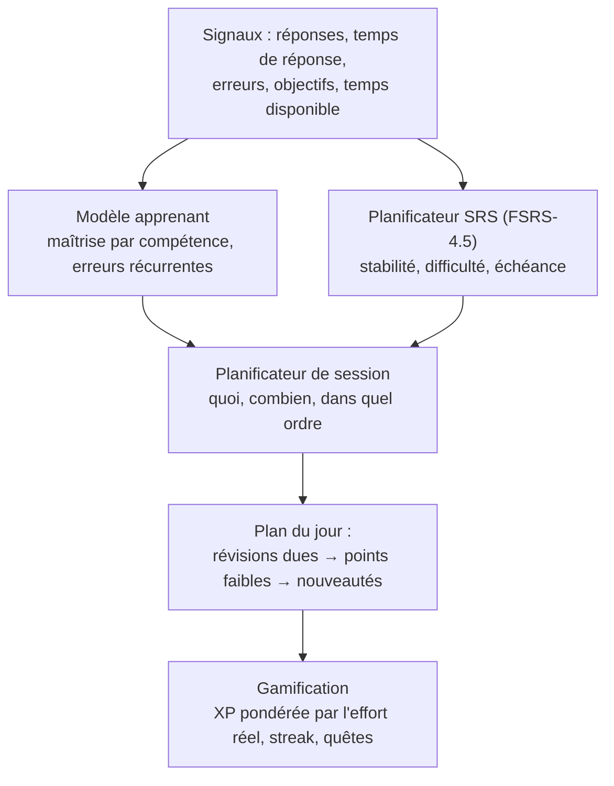
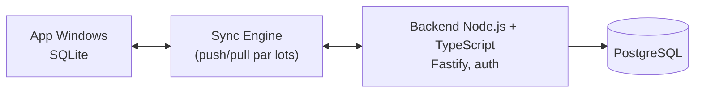
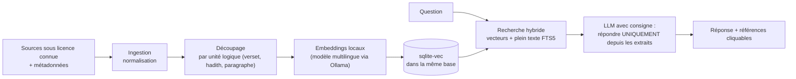

# Savio — Analyse et architecture

> **Savio** : « sage » en italien ; on y entend aussi « savoir » et *savvy*. Un compagnon d'apprentissage qui accompagne pendant des mois ou des années.
> Plateforme éducative IA **libre, gratuite, locale d'abord**, ciblant Windows en premier.

Ce document est la référence technique du projet. Il répond aux points 1 à 20 du cahier des charges. Le suivi d'avancement vit dans [`PROGRESS.md`](./PROGRESS.md).

---

## 1. Analyse globale

Le projet combine trois produits qui existent séparément aujourd'hui :

| Brique | Équivalent marché | Ce qui est vraiment difficile |
|---|---|---|
| Moteur de mémorisation | Anki | Planification fiable (SRS), modèle de l'apprenant |
| Parcours guidés gamifiés | Duolingo, Brilliant | **Contenu** de qualité, en volume, sous licence libre |
| Tuteur conversationnel | ChatGPT, Speak | IA locale de qualité suffisante sur un PC moyen |

La valeur unique de Savio est **le lien entre les trois** : le tuteur IA lit le modèle de l'apprenant, génère des cartes et exercices qui alimentent le moteur SRS, et chaque réponse enrichit le modèle. Un chatbot seul n'apprend rien de l'utilisateur ; un Anki seul n'explique rien.

**Conclusion structurante :** le *Learning Engine* (déterministe, testé, sans IA) est la colonne vertébrale. L'IA est un **client** du moteur, jamais l'inverse. L'application doit rester utile même sans aucun modèle IA installé.

## 2. Positionnement

« Le compagnon d'apprentissage personnel qui reste sur ta machine. »

- **Pour qui :** autodidactes adultes, étudiants, familles, écoles et associations qui veulent un outil sans abonnement ni collecte de données.
- **Différenciation :** gratuit et libre, local/hors ligne, multi-domaines dans un seul profil, IA interchangeable (locale par défaut), sources citées pour les domaines sensibles.
- **Ce que Savio n'est pas (au début) :** un réseau social, une plateforme de cours vidéo, un service cloud.

## 3. Forces et risques

**Forces**
- Aucun coût d'infrastructure obligatoire : tout tourne sur le PC.
- Respect de la vie privée par construction (les données ne quittent pas la machine par défaut).
- Écosystème open source mature : Tauri, SQLite, Ollama, whisper.cpp, Stockfish, base de puzzles Lichess (CC0).
- Architecture « ports & adapters » : chaque brique (IA, voix, stockage) est remplaçable.

**Risques (et réponse)**

| Risque | Gravité | Réponse |
|---|---|---|
| Périmètre gigantesque (langues + échecs + islam + voix + RAG) | Critique | MVP strict, modules ajoutés un par un ; chaque domaine = un module de contenu |
| Qualité de l'IA locale sur PC modeste | Élevée | Le moteur fonctionne sans IA ; profils de modèles par matériel ; provider distant optionnel |
| Hallucinations (surtout Islam, histoire) | Élevée | RAG avec sources, citations obligatoires, refus explicite si pas de source, avertissement de divergence |
| Contenu pédagogique : volume et licences | Élevée | Contenu original + CC0/CC BY(-SA) uniquement ; registre des licences ; format ouvert pour contributions |
| Analyse de prononciation | Moyenne | Phase 2, objectif réaliste : comparaison transcription/attendu, puis alignement phonétique plus tard |
| Installateur Windows non signé (alerte SmartScreen) | Moyenne | Signature gratuite pour projets OSS (ex. SignPath Foundation) à demander avant la v1 |
| Épuisement du mainteneur | Moyenne | Docs claires, CI, issues « good first issue », modules de contenu contribuables sans toucher au code |

## 4. Stack technique

| Couche | Choix | Licence | Pourquoi |
|---|---|---|---|
| Shell desktop | **Tauri 2** | MIT / Apache-2.0 | Exécutable léger (WebView2 système), backend Rust, plugins officiels |
| UI | **React 19 + TypeScript strict** | MIT | Écosystème, contributeurs nombreux |
| Build | **Vite** | MIT | Rapide, standard de facto avec Tauri |
| État UI | **Zustand** | MIT | Minimal, sans boilerplate |
| Base locale | **SQLite** via `tauri-plugin-sql` | MIT/Apache, SQLite domaine public | Fichier unique, sauvegarde/export triviaux |
| Accès données | **Repositories TypeScript** (SQL explicite) | — | Pas d'ORM lourd ; schéma lisible ; portable vers PostgreSQL |
| SRS | **Implémentation maison de FSRS-4.5** | AGPL (notre code) | Algorithme moderne publié ouvertement ; pas de dépendance |
| IA locale | **Ollama** ou **llama.cpp server** | MIT | Locaux, gratuits, API simple |
| IA distante (option) | Toute API **compatible OpenAI** | — | Un seul adaptateur couvre LM Studio, vLLM, services commerciaux |
| Tests | **Vitest** | MIT | Même config que Vite |
| Qualité | ESLint + typescript-eslint + Prettier | MIT | Standard |
| CI/CD | **GitHub Actions** + `tauri-action` | MIT | Gratuit pour dépôts publics |
| Installateur | **NSIS** (via Tauri) | zlib | Produit `Savio_x.y.z_x64-setup.exe` |

## 5. Pourquoi Tauri + React + TypeScript + Vite

- **Tauri vs Electron :** Electron embarque Chromium et Node (~80–150 Mo installé, forte RAM). Tauri utilise WebView2 déjà présent sur Windows 10/11 : installateur de quelques Mo, RAM réduite. Le backend Rust donne un accès natif (fichiers, processus « sidecar » pour Stockfish ou whisper.cpp) avec un modèle de permissions explicite (*capabilities*).
- **Contrepartie assumée :** il faut Rust pour compiler. La CI le fait ; un contributeur UI peut travailler dans le navigateur (`npm run dev`) sans Rust grâce aux repositories en mémoire.
- **React + TypeScript :** le plus grand vivier de contributeurs ; TypeScript strict protège le moteur métier.
- **Vite :** démarrage instantané, intégration Tauri officielle, Vitest partage sa configuration.
- **Portabilité :** le cœur (`src/core`) est du TypeScript pur, sans React ni Tauri. Il pourra tourner sur le web, dans React Native, ou côté serveur. Tauri 2 sait aussi produire Android/iOS/macOS.

## 6. Architecture générale



**Règles :**
1. `src/core` n'importe **jamais** React, Tauri ou le DOM (vérifié par ESLint).
2. Les composants UI n'ont pas de logique métier : ils appellent un service.
3. Toute dépendance externe (base, IA, voix, horloge) passe par un **port** injecté. Le temps lui-même est injecté (`now: Date`) pour que le moteur soit testable.

## 7. Architecture IA



- **`AiProvider`** : interface minimale `chat(messages, options) → stream de texte`, plus `locality: 'local' | 'remote'`.
- **`AiGateway`** : sélectionne le provider configuré, applique délais et annulation, et **signale à l'UI quand une requête quitte la machine**.
- **`TutorEngine`** : construit le prompt système à partir d'un *résumé du profil* (niveau, points faibles, erreurs récurrentes, objectif du jour), jamais de l'historique brut complet (économie de contexte, confidentialité).
- **Sorties structurées** : le tuteur peut proposer des actions JSON (`create_flashcards`, `start_quiz`…). Elles sont **validées** puis exécutées par le moteur — l'IA ne modifie jamais la base directement. C'est la même mécanique qui servira aux commandes vocales.
- **Évaluation** (`ai/evaluation`, phase 2) : jeux de questions de référence pour comparer les modèles locaux sur nos tâches pédagogiques.

## 8. Architecture vocale (phase 2)



- **Ports** : `SpeechToText`, `TextToSpeech`, `VoiceActivityDetector` (déjà déclarés dans `src/core/voice`).
- **Exécution locale** : whisper.cpp et Piper tournent en *sidecar* Tauri (processus séparés, modèles téléchargés à la demande, jamais inclus dans l'installateur).
- **Repli sans installation** : synthèse vocale Windows via l'API Web Speech de WebView2.
- **Commandes vocales** : un registre unique de commandes typées, partagé entre voix, palette de commandes clavier et actions proposées par l'IA. Analyse en deux temps : règles rapides (« répète », « suivant »), puis le LLM en *tool calling* pour les demandes libres.
- **Interruption** (*barge-in*) : la lecture TTS s'arrête dès que le VAD détecte la voix.
- **Prononciation** : v1 = comparaison texte attendu / transcription mot à mot + vitesse et pauses ; v2 = alignement phonétique (modèles wav2vec2 open source).
- **Confidentialité** : l'audio n'est pas stocké par défaut ; les transcriptions sont supprimables.

## 9. Learning Engine



- **Unité de base : l'élément mémorisable** (`ReviewItem`) — mot, règle, formule, date, ouverture d'échecs, verset… Toute matière se ramène à des éléments reliés à des **compétences** (`skill`).
- **SRS (FSRS-4.5)** : chaque élément a une *stabilité* (jours avant que le rappel tombe à 90 %) et une *difficulté*. Les échelons du cahier des charges en dérivent :

  | Échelon | Condition |
  |---|---|
  | Nouveau | jamais révisé |
  | Apprentissage | stabilité < 1 jour ou oubli récent |
  | Fragile | stabilité < 7 jours |
  | Connu | stabilité < 30 jours |
  | Maîtrisé | stabilité ≥ 30 jours |

- **Historique des révisions en journal immuable** (`review_logs`) : l'état SRS peut être recalculé à partir du journal, ce qui facilite la synchronisation future et l'optimisation des paramètres FSRS par utilisateur.
- **Modèle apprenant** : par compétence, taux de réussite lissé, nombre de tentatives, dernière pratique ; et un registre d'**erreurs étiquetées** (`confusion: "ser/estar"`). C'est ce qui permet au tuteur de dire « tu confonds régulièrement X et Y ». Le *graphe de connaissances* (prérequis entre compétences) est une table `skill_edges`, utilisée dès que le contenu le déclare.
- **Gamification honnête** : l'XP récompense les réponses correctes, avec un bonus pour les rappels difficiles réussis, et un plafond quotidien d'XP par activité « facile » pour ne pas récompenser le farming de clics.

## 10. Architecture SQLite

Fichier : `%APPDATA%\org.savio.app\savio.db`. Migrations versionnées dans `database/migrations/` et embarquées dans l'exécutable.

Tables MVP (voir `database/migrations/0001_init.sql`) :

| Table | Rôle |
|---|---|
| `profile` | Prénom, langue d'interface, objectif quotidien, préférences |
| `subjects` | Matières activées et niveau déclaré |
| `skills`, `skill_edges` | Compétences et prérequis (graphe de connaissances) |
| `review_items` | Éléments à mémoriser + état SRS courant |
| `review_logs` | Journal immuable de chaque révision |
| `mistakes` | Erreurs étiquetées par compétence |
| `daily_activity` | Minutes, XP, éléments vus par jour (streak, stats) |
| `ai_messages` | Historique du tuteur (désactivable, supprimable) |
| `settings` | Clé/valeur : provider IA, thème, confidentialité |

**Conventions pour la synchronisation future :** identifiants UUID générés côté client, `created_at`/`updated_at` en ISO-8601 UTC, suppressions logiques (`deleted_at`), journaux en ajout seul. Aucune clé auto-incrémentée exposée.

## 11. Cloud futur (phase 4)



- **Optionnel et auto-hébergeable** : un `docker compose up` pour une école ou une association.
- **Stratégie de fusion** : journaux (`review_logs`, `daily_activity`) fusionnés par union ; entités simples en « dernier écrit gagne » par ligne via `updated_at`.
- Le schéma SQLite est volontairement compatible PostgreSQL (types simples, UUID texte).
- Redis/WebSockets uniquement si un besoin réel apparaît (ligues temps réel par ex.).

## 12. Architecture RAG (phase 3)



- **Métadonnées obligatoires par extrait** : source, auteur, ouvrage, référence (ex. sourate:verset, recueil:numéro), langue, licence, date, niveau de confiance, école/courant si pertinent.
- **Règles de génération** : citations recopiées depuis l'extrait, jamais générées ; « je n'ai pas de source pour cela » plutôt qu'une invention ; divergences entre écoles présentées comme telles, avec leurs références.
- **Licences** : les textes sources (ex. texte coranique) et leurs **traductions** ont des licences distinctes ; chaque corpus est inscrit dans `docs/CONTENT_LICENSES.md` avant d'être intégré.
- `sqlite-vec` (MIT/Apache) garde tout dans un seul fichier local, sans serveur vectoriel.

## 13. Architecture GitHub

```text
push / pull request ──► ci.yml : install → lint → typecheck → tests → build web
push sur main / tag ───► build-windows.yml : build Tauri sur windows-latest → artifact .exe
tag v*.*.* ────────────► build-windows.yml : brouillon de GitHub Release avec Setup.exe
```

- **Auto-update (plus tard)** : `tauri-plugin-updater` + fichier `latest.json` publié dans les Releases, signé avec une clé stockée dans GitHub Secrets.
- **Secrets** : aucun dans le dépôt ; `.env` ignoré ; `.env.example` documente les variables.

## 14. Arborescence

```text
savio/
├── .github/
│   ├── workflows/ci.yml, build-windows.yml
│   ├── ISSUE_TEMPLATE/bug_report.yml, feature_request.yml, content_contribution.yml
│   └── PULL_REQUEST_TEMPLATE.md
├── database/migrations/          # SQL versionné, embarqué dans l'exe
├── docs/                         # ARCHITECTURE, PROGRESS, CONTENT_LICENSES, LICENSING
├── public/
├── src/
│   ├── core/                     # ★ TypeScript pur, réutilisable partout
│   │   ├── domain/               # types métier
│   │   ├── srs/                  # FSRS + échelons de maîtrise
│   │   ├── learner/              # modèle apprenant, erreurs récurrentes
│   │   ├── engine/               # planificateur de session, recommandations
│   │   ├── gamification/         # XP, niveaux, streak
│   │   ├── ai/                   # gateway, providers, prompts, tutor
│   │   ├── voice/                # ports STT/TTS (phase 2)
│   │   ├── content/              # contenu de démarrage (original)
│   │   └── ports/                # interfaces de repositories, horloge, id
│   ├── infrastructure/           # adaptateurs : memory, sqlite, http
│   ├── services/                 # orchestration (container d'injection)
│   ├── stores/                   # état UI (Zustand)
│   ├── features/                 # écrans : onboarding, dashboard, review, assistant, settings
│   ├── components/ui/            # design system
│   ├── styles/                   # tokens et thèmes
│   └── app/                      # racine React, navigation
├── src-tauri/                    # shell Rust, permissions, config installateur
├── tests/core/                   # tests du moteur
├── .env.example, .gitignore, README.md, CONTRIBUTING.md, CODE_OF_CONDUCT.md, SECURITY.md
└── package.json, tsconfig.json, vite.config.ts, eslint.config.js
```

Les futurs **plugins** (`plugins/language`, `plugins/chess`…) seront des paquets de contenu + code déclarant leurs compétences, types d'exercices et commandes ; le format sera figé après deux modules réels (langues, échecs) pour ne pas concevoir une API de plugins dans le vide.

## 15. MVP détaillé (phase 1)

Critère de réussite : **un nouvel utilisateur installe le `.exe`, choisit ses matières, révise ses premières cartes, discute avec le tuteur, et retrouve sa progression le lendemain — même hors ligne.**

| Fonction | Inclus dans le MVP |
|---|---|
| Installateur Windows | NSIS via CI |
| Onboarding | Prénom, matières, niveau, minutes/jour, motivation |
| Dashboard | Salutation, streak, objectif du jour, cartes dues, recommandations par matière |
| Première expérience | Session de révision SRS sur un deck de démarrage par matière (espagnol, échecs, islam : bases) |
| Tuteur IA | Chat texte avec Ollama local ; repli hors ligne explicite ; indicateur local/distant |
| Progression | XP, niveaux, streak, minutes, maîtrise par échelon |
| Données | SQLite, export JSON, suppression totale |
| Thèmes | Clair / sombre / système |
| Qualité | Tests du moteur, CI verte, build Windows en artifact |

Exclus du MVP : voix, échecs jouables, RAG, synchronisation, ligues.

## 16. Roadmap

| Phase | Contenu | Jalon |
|---|---|---|
| **1 — Fondation** | MVP ci-dessus | `v0.1.0` Setup.exe sur GitHub Releases |
| **2 — Langues & voix** | Exercices de langue (QCM, complétion, remise en ordre, dictée), conversation scénarisée avec bilan, TTS, STT whisper.cpp, commandes vocales, « Répète après moi » v1, génération de cartes par l'IA | `v0.2` – `v0.4` |
| **3 — Échecs, Islam, RAG** | chess.js + échiquier, puzzles Lichess (CC0), Stockfish sidecar, analyse expliquée ; module Islam avec RAG sourcé ; maths/sciences de base | `v0.5` – `v0.7` |
| **4 — Ouverture** | Format de plugins, sync optionnelle, serveur auto-hébergeable, auto-update, macOS, web, mobile | `v1.0` |

## 17. Plan de développement Windows

1. **Prérequis** (une fois) : Node.js LTS, Rust (`rustup`), Visual Studio Build Tools « Développement desktop en C++ », WebView2 (déjà présent sur Windows 10/11 à jour). Détail pas à pas dans le README.
2. **Dev UI seule** : `npm install` puis `npm run dev` → navigateur, données en mémoire.
3. **Dev application** : `npm run tauri:dev` → fenêtre native, SQLite réel.
4. **Build** : `npm run tauri:build` → `src-tauri/target/release/bundle/nsis/Savio_0.1.0_x64-setup.exe`.
5. **CI** : chaque push sur `main` produit l'installateur en artifact téléchargeable ; un tag `v0.1.0` crée un brouillon de Release.

## 18. Stratégie open source

- Dépôt public dès le départ, issues et discussions ouvertes.
- **Contribuer du contenu ne demande pas de coder** : decks et leçons en JSON/Markdown validés par schéma.
- Labels : `good first issue`, `content`, `engine`, `ui`, `ai`, `voice`, `i18n`.
- Gouvernance simple au début (mainteneur principal), documentée dans CONTRIBUTING.
- **DCO** (`Signed-off-by`) plutôt qu'un CLA : plus léger et respecte les contributeurs.
- Financement : GitHub Sponsors, Open Collective, subventions (ex. NLnet / NGI pour les logiciels libres en Europe). Aucun paywall.

## 19. Licence recommandée

| | MIT | Apache-2.0 | GPLv3 | AGPLv3 |
|---|---|---|---|---|
| Réutiliser, modifier, redistribuer | Oui | Oui | Oui | Oui |
| Usage commercial | Oui | Oui | Oui | Oui |
| Obligation de publier les modifications si on **distribue** | Non | Non | **Oui** | **Oui** |
| Obligation si on l'offre comme **service en ligne (SaaS)** | Non | Non | Non | **Oui** |
| Logiciel dérivé peut devenir propriétaire | Oui | Oui | Non | Non |
| Clause brevets explicite | Non | Oui | Oui | Oui |
| Compatible avec Stockfish (GPLv3) intégré | Non* | Non* | Oui | Oui |

\* Possible seulement en gardant Stockfish comme programme séparé.

**Recommandation : AGPL-3.0-or-later pour le code, CC BY-SA 4.0 pour le contenu pédagogique original.**

Justification :
- L'objectif déclaré est que le logiciel **reste libre**, y compris quand la synchronisation cloud et les instances auto-hébergées arriveront. Avec MIT/Apache, une entreprise pourrait reprendre Savio, le fermer et le vendre en abonnement — exactement ce que le projet veut éviter. Avec la GPL seule, une version SaaS modifiée échapperait à l'obligation de partage. L'AGPL couvre ce cas.
- Elle reste compatible avec tous les usages légitimes : écoles, associations, usage commercial respectant la licence.
- Elle est compatible avec Stockfish (GPLv3) et chessground (GPLv3) pour le module d'échecs.
- Contrepartie : certaines entreprises évitent l'AGPL. C'est acceptable pour un projet communautaire et gratuit.
- Le contenu en CC BY-SA 4.0 permet à d'autres projets éducatifs de le réutiliser en citant la source et en partageant à l'identique.

## 20. Stratégie IA locale / open source

| Profil matériel | Modèle conseillé (indicatif) | Usage |
|---|---|---|
| PC modeste (8 Go RAM, pas de GPU) | 1–4 milliards de paramètres, quantifié Q4 | Explications courtes, cartes, quiz |
| PC standard (16 Go RAM) | 7–9 milliards, Q4 | Tutorat général, conversation |
| PC puissant / GPU ≥ 8 Go VRAM | 12–30 milliards | Raisonnement, corrections fines, RAG |

- **Runtime par défaut : Ollama** (installation en un clic, API locale sur `127.0.0.1:11434`). Alternative : `llama-server` de llama.cpp, LM Studio — via l'adaptateur OpenAI-compatible.
- **Licences de modèles** : variables (Apache-2.0 pour plusieurs familles, licences « communautaires » restrictives pour d'autres). L'écran de configuration affiche la licence du modèle choisi ; les recommandations par défaut privilégient les modèles sous licence Apache-2.0 ou MIT.
- **Détection matérielle** (phase 2) : commande Rust qui lit RAM/VRAM et propose un profil.
- **Embeddings et STT** aussi locaux (modèles d'embeddings multilingues via Ollama, Whisper via whisper.cpp).
- **Distant = opt-in explicite**, avec bandeau visible « vos messages sont envoyés à … » à chaque usage.
- **Aucun entraînement** sur les conversations sans consentement explicite et séparé.

## Annexe — Règles de décision

À chaque choix : aide-t-il réellement à apprendre ? L'IA agit-elle en tuteur ? Est-ce maintenable ? Compatible libre et gratuit ? Les données restent-elles chez l'utilisateur ? L'expérience donne-t-elle envie de revenir ?
